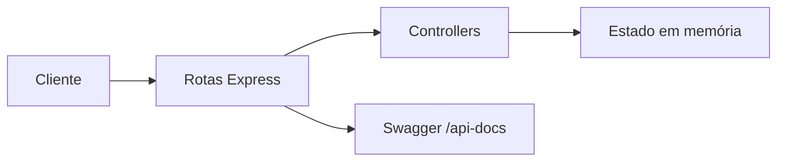

# API Cadastro Autoescola


A **API Cadastro Autoescola** é uma API REST desenvolvida em **Node.js com Express** para simular a gestão de autenticação e o controle de gastos dos veículos de uma autoescola.

O projeto permite realizar login, cadastrar, listar, consultar, atualizar e remover despesas, com documentação interativa via **Swagger** e cobertura de testes funcionais com **Mocha, Chai e Supertest**.

Estruturada de forma simples e didática, a aplicação utiliza dados em memória, sendo ideal para **estudo, demonstração de boas práticas em APIs REST e evolução futura para autenticação real e persistência em banco de dados**.

## Visão geral

A aplicação permite:

- Autenticar um usuário da plataforma
- Listar gastos cadastrados
- Buscar um gasto por ID
- Criar novos gastos
- Atualizar um gasto existente
- Remover gastos

Os dados são mantidos em memória, o que torna o projeto ideal para aprendizado, demonstração de conceitos e testes locais rápidos.

## Demonstração local

Com a API em execução, os principais acessos são:

- API base: [http://localhost:3000](http://localhost:3000)
- Swagger UI: [http://localhost:3000/api-docs](http://localhost:3000/api-docs)

## Tecnologias utilizadas

- Node.js
- Express
- Swagger UI Express
- Mocha
- Chai
- Supertest

## Arquitetura do projeto

```text
.
|-- Controle/      # regras de entrada e saída da API
|-- Model/         # estado em memória e dados iniciais
|-- Servers/       # app Express e definição das rotas
|-- Swagger/       # especificação OpenAPI e integração com Swagger UI
|-- fixtures/      # massas de teste
|-- login/         # testes funcionais de autenticação
|-- gastos/        # testes funcionais de gastos
|-- docs/          # artefatos de documentação complementar
|-- index.js       # bootstrap da aplicação
|-- package.json
```

### Organização em camadas

- `index.js` inicia o servidor HTTP
- `Servers/app.js` configura o Express e publica o Swagger
- `Servers/routes.js` centraliza os endpoints
- `Controle/` contém os controllers da API
- `Model/database.js` controla o estado em memória
- `Model/initialData.js` define a carga inicial da aplicação

## Fluxo da aplicação



## Pré-requisitos

- Node.js 18 ou superior
- npm

## Instalação

```bash
npm install
```

## Como executar

Para iniciar o projeto:

```bash
npm start
```

A aplicação sobe por padrão na porta `3000`.


## Testes

Para rodar os testes automatizados:

```bash
npm test
```

Cobertura funcional atual:

- Login com credenciais válidas
- Login com credenciais inválidas
- Listagem de gastos
- Criação de gasto
- Consulta por ID
- Atualização de gasto
- Remoção de gasto

## Persistência

Esta API não utiliza banco de dados no estado atual.

Isso significa que:

- Os dados são armazenados apenas em memória
- Reiniciar a aplicação restaura os dados iniciais
- O projeto está preparado para evolução futura para uma persistência real

## Endpoints

| Método | Rota | Descrição |
|---|---|---|
| `POST` | `/login` | Realiza autenticação do usuário |
| `GET` | `/gastos` | Lista todos os gastos |
| `GET` | `/gastos/:id` | Busca um gasto por ID |
| `POST` | `/gastos` | Cria um novo gasto |
| `PUT` | `/gastos/:id` | Atualiza parcialmente um gasto |
| `DELETE` | `/gastos/:id` | Remove um gasto |


## Diferenciais do projeto

- Documentação navegável com Swagger
- Testes funcionais cobrindo os principais fluxos da API
- Estrutura simples e organizada para estudo de arquitetura em camadas
- Base pronta para evolução com autenticação real e banco de dados


