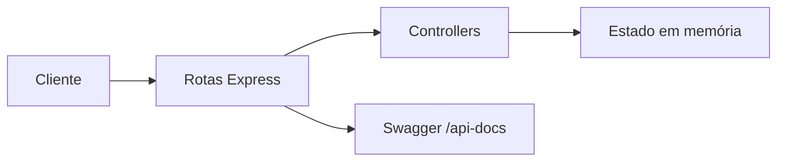

# API Cadastro Autoescola


API REST desenvolvida em Node.js para autenticação e controle de gastos dos veículos de uma autoescola.

Este projeto foi estruturado para fins de estudo, prática de API REST, documentação com OpenAPI/Swagger e testes funcionais automatizados.

## Visão geral

A aplicação permite:

- autenticar um usuário da plataforma
- listar gastos cadastrados
- buscar um gasto por ID
- criar novos gastos
- atualizar um gasto existente
- remover gastos

Os dados são mantidos em memória, o que torna o projeto ideal para aprendizado, demonstração de conceitos e testes locais rápidos.

## Demonstração local

Com a API em execução, os principais acessos são:

- API base: [http://localhost:3000](http://localhost:3000)
- Swagger UI: [http://localhost:3000/api-docs](http://localhost:3000/api-docs)

## Tecnologias utilizadas

- Node.js
- Express
- Swagger UI Express
- Mocha
- Chai
- Supertest

## Arquitetura do projeto

```text
.
|-- Controle/      # regras de entrada e saída da API
|-- Model/         # estado em memória e dados iniciais
|-- Servers/       # app Express e definição das rotas
|-- Swagger/       # especificação OpenAPI e integração com Swagger UI
|-- fixtures/      # massas de teste
|-- login/         # testes funcionais de autenticação
|-- gastos/        # testes funcionais de gastos
|-- docs/          # artefatos de documentação complementar
|-- index.js       # bootstrap da aplicação
|-- package.json
```

### Organização em camadas

- `index.js` inicia o servidor HTTP
- `Servers/app.js` configura o Express e publica o Swagger
- `Servers/routes.js` centraliza os endpoints
- `Controle/` contém os controllers da API
- `Model/database.js` controla o estado em memória
- `Model/initialData.js` define a carga inicial da aplicação

## Fluxo da aplicação



## Pré-requisitos

- Node.js 18 ou superior
- npm

## Instalação

```bash
npm install
```

## Como executar

Para iniciar o projeto:

```bash
npm start
```

A aplicação sobe por padrão na porta `3000`.

Para alterar a porta em sistemas Unix-like:

```bash
PORT=4000 npm start
```

Para alterar a porta no Windows PowerShell:

```powershell
$env:PORT=4000
npm start
```

## Testes

Para rodar os testes automatizados:

```bash
npm test
```

Cobertura funcional atual:

- login com credenciais válidas
- login com credenciais inválidas
- listagem de gastos
- criação de gasto
- consulta por ID
- atualização de gasto
- remoção de gasto

## Dados iniciais

Ao iniciar a aplicação, o estado em memória começa com os dados abaixo.

### Usuário padrão

```json
{
  "id": 1,
  "username": "admin",
  "password": "123456",
  "role": "gestor"
}
```

### Gasto inicial

```json
{
  "id": 1,
  "veiculoId": "CAR-001",
  "tipo": "combustivel",
  "valor": 350.75,
  "data": "2026-04-01",
  "descricao": "Abastecimento do início do mês"
}
```

## Persistência

Esta API não utiliza banco de dados no estado atual.

Isso significa que:

- os dados são armazenados apenas em memória
- reiniciar a aplicação restaura os dados iniciais
- o projeto está preparado para evolução futura para uma persistência real

## Endpoints

| Método | Rota | Descrição |
|---|---|---|
| `POST` | `/login` | Realiza autenticação do usuário |
| `GET` | `/gastos` | Lista todos os gastos |
| `GET` | `/gastos/:id` | Busca um gasto por ID |
| `POST` | `/gastos` | Cria um novo gasto |
| `PUT` | `/gastos/:id` | Atualiza parcialmente um gasto |
| `DELETE` | `/gastos/:id` | Remove um gasto |

## Exemplos de uso

### Login

Requisição:

```json
{
  "username": "admin",
  "password": "123456"
}
```

Resposta `200`:

```json
{
  "message": "Login realizado com sucesso.",
  "token": "token-1-admin",
  "user": {
    "id": 1,
    "username": "admin",
    "role": "gestor"
  }
}
```

### Criar gasto

Requisição:

```json
{
  "veiculoId": "CAR-003",
  "tipo": "lavagem",
  "valor": 80,
  "data": "2026-04-15",
  "descricao": "Lavagem completa"
}
```

Resposta `201`:

```json
{
  "id": 2,
  "veiculoId": "CAR-003",
  "tipo": "lavagem",
  "valor": 80,
  "data": "2026-04-15",
  "descricao": "Lavagem completa"
}
```

### Filtrar gastos

Exemplos de consulta:

- `GET /gastos`
- `GET /gastos?veiculoId=CAR-001`
- `GET /gastos?tipo=combustivel`

## Tipos de gasto aceitos

Conforme a especificação OpenAPI do projeto:

- `oleo`
- `combustivel`
- `lavagem`
- `pastilha_freio`
- `velas`

## Exemplos com cURL

### Realizar login

```bash
curl -X POST http://localhost:3000/login \
  -H "Content-Type: application/json" \
  -d "{\"username\":\"admin\",\"password\":\"123456\"}"
```

### Listar gastos

```bash
curl http://localhost:3000/gastos
```

### Criar um gasto

```bash
curl -X POST http://localhost:3000/gastos \
  -H "Content-Type: application/json" \
  -d "{\"veiculoId\":\"CAR-003\",\"tipo\":\"lavagem\",\"valor\":80,\"data\":\"2026-04-15\",\"descricao\":\"Lavagem completa\"}"
```

## Diferenciais do projeto

- documentação navegável com Swagger
- testes funcionais cobrindo os principais fluxos da API
- estrutura simples e organizada para estudo de arquitetura em camadas
- base pronta para evolução com autenticação real e banco de dados

## Melhorias futuras

- adicionar autenticação protegendo as rotas de gastos
- integrar banco de dados relacional ou NoSQL
- incluir validação de payload com biblioteca dedicada
- criar testes de cenários de erro adicionais
- adicionar pipeline de CI

## Observações

- o token retornado no login é ilustrativo
- as rotas de gastos ainda não exigem autenticação
- o projeto é voltado para aprendizado, portfólio e evolução incremental
